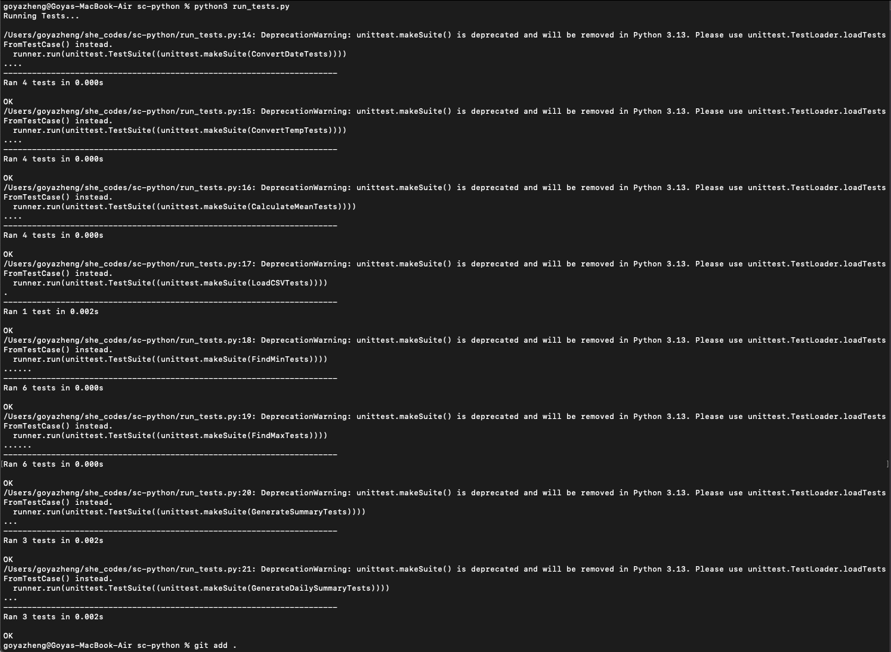

# Goya Zheng - Python Task

[My portfolio site](goyadev.github.io)

## Project Requirements

This python weather app project shows my coding in python. The aim was to make all the tests pass by writing functions in the weather.py file.

### Content

The code written for this project is in weather.py. All other files were provided as a part of the project.

- [ ] Functions written
- [ ] Tests passing
- [ ] Screenshot of tests passing in terminal

### Technical

There are 8 different functions that were coded. These cover a variety of aspects such as for loops, string concatenation, methods and reusing functions in other functions.

- [ ] Version controlled with Git

#### Screenshots

